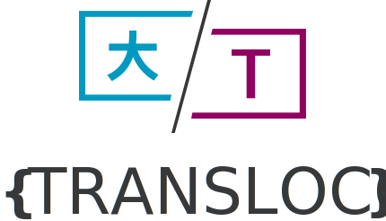

 

 

  The internationalization (i18n) library for Angular

<h2></h2>

Transloco allows you to define translations for your content in different languages and switch between them easily in runtime.
It exposes a rich API to manage translations efficiently and cleanly. It provides multiple plugins that will improve your development experience. Here is a small taste of the features it offers:

✅ &nbsp;Clean and DRY templates  
✅ &nbsp;Support for Lazy Load  
✅ &nbsp;Support for Multiple Languages Simultaneously  
✅ &nbsp;Support for Multiple Fallbacks  
✅ &nbsp;Support for Testing  
✅ &nbsp;Support for SSR  
✅ &nbsp;Support for L10N  
✅ &nbsp;Rich Plugins  
✅ &nbsp;Hackable  
✅ &nbsp;Schematics  
✅ &nbsp;Standalone support

- 🤓 &nbsp;Learn about it on the [docs site](https://jsverse.github.io/transloco/)
- 🎥 &nbsp;Watch our instructional [video guides](https://www.youtube.com/watch?v=MYkYcafJdGw&list=PLTuTW7EgL6ouXk5BqE4zWdDJkAuC4HTWi)
- 🚀 &nbsp;See it in action on [CodeSandbox](https://codesandbox.io/s/jsverse-transloco-kn52hs)
- 😎 &nbsp;Use [schematics](https://jsverse.github.io/transloco/docs/schematics)
- 👉 &nbsp;Checkout the [live application](https://jsverse.github.io/transloco/live-app)
- 📖 &nbsp;Read the blog [posts](https://jsverse.github.io/transloco/docs/blog-posts)
- ❓ &nbsp;Find answers in our [FAQ](https://jsverse.github.io/transloco/docs/faq) section

## Contributors ✨

Thank goes to all these wonderful [people who contributed](https://github.com/jsverse/transloco/graphs/contributors) ❤️
