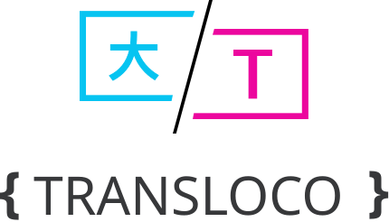

> [!IMPORTANT]  
> The Transloco packages are now published under the **@jsverse** scope, update your dependencies to get the latest features 🚀

 

 

  The internationalization (i18n) library for Angular

<h3></h3>

Transloco enables you to define translations for your content in multiple languages and seamlessly switch between them at runtime. With its robust API, managing translations becomes efficient and maintainable. Additionally, Transloco offers an array of plugins designed to enhance your development experience. Here's a quick look at its powerful features:

✅ &nbsp;Signal-based API  
✅ &nbsp;Fully supports standalone components  
✅ &nbsp;Clean and DRY templates  
✅ &nbsp;Lazy Loading support  
✅ &nbsp;Handle multiple languages simultaneously  
✅ &nbsp;Flexible fallbacks for missing translations  
✅ &nbsp;Comprehensive testing support  
✅ &nbsp;Server-Side Rendering (SSR) compatibility  
✅ &nbsp;Localization (L10N) support  
✅ &nbsp;A variety of rich plugins  
✅ &nbsp;Highly customizable and hackable  
✅ &nbsp;Schematics

Transloco is your all-in-one solution for internationalizing Angular applications with ease and flexibility.

- 🤓 &nbsp;Explore the (brand new ✨) [documentation](https://jsverse.gitbook.io/transloco) to learn more.
- 🚀 &nbsp;Check out the [Sandbox & Examples](https://jsverse.gitbook.io/transloco/resources/sandbox-and-examples) to see Transloco in action.
- 😎 &nbsp;Leverage [Schematics](https://jsverse.gitbook.io/transloco/developer-tools/schematics) for streamlined setup and configuration.
- 📖 &nbsp;Dive into insightful [blog posts](https://jsverse.gitbook.io/transloco/resources/blog-posts).
- ❓ &nbsp;Find answers to common questions in our [FAQs](https://jsverse.gitbook.io/transloco/resources/faqs).

## Contributors ✨

Thank goes to all these wonderful [people who contributed](https://github.com/jsverse/transloco/graphs/contributors) ❤️
