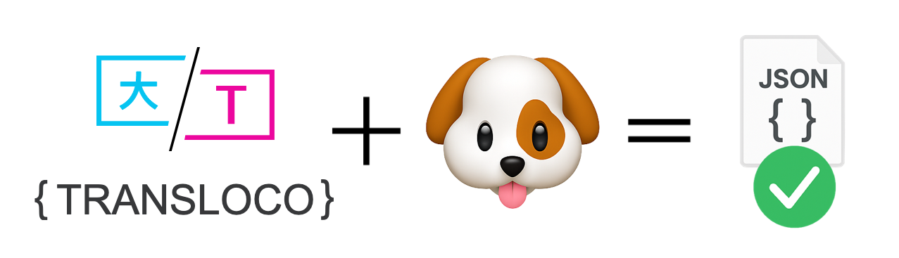

# Translation Files Validation in Angular with Transloco

   Written by Shahar Kazaz, Co-Creator & maintainer of Transloco\
[<picture><source srcset="../../.gitbook/assets/Octicons-mark-github-dark.png" media="(prefers-color-scheme: dark)"></picture>](https://github.com/shaharkazaz) [<picture><source srcset="../../.gitbook/assets/medium_logo_dark.png" media="(prefers-color-scheme: dark)"></picture>](https://medium.com/@shahar.kazaz) [](https://www.linkedin.com/in/shahar-kazaz/)

<figure><picture><source srcset="../../.gitbook/assets/dark version.png" media="(prefers-color-scheme: dark)"></picture><figcaption></figcaption></figure>

When building enterprise Angular apps with multiple teams, merge conflicts in translation files are inevitable. A tiny mistake—like an extra comma—can break your JSON, and the error might go unnoticed until it's shipped:

```json
{
  "key": "",
  "keyTwo": "", 👈
}
```

Suddenly, your app is broken in staging or production because of an invalid translation file. It’s a classic case of “it worked on my machine”—but not for your users.

To avoid these headaches, the [`@jsverse/transloco-validator`](../../tools/validator.md) linter will:

* Validate your translation files (catching syntax errors)
* Detect duplicate keys

You can run this validation in two ways: **as a pre-commit hook** or **as a CI job in GitHub Actions**.

***

### Option 1: Validate on Pre-Commit with Husky & lint-staged

This approach prevents broken translation files from ever making it into your repository.

1.  **Install the validator as a dev dependency:**

    ```bash
    npm install @jsverse/transloco-validator --save-dev
    ```
2.  **Set up Husky and lint-staged:**\
    To ensure your translation files are always valid, configure Transloco Validator to run on specific paths during pre-commit checks. You can easily set this up in your `lint-staged` configuration.\
    \
    `lint-staged` supports [multiple configuration formats](https://github.com/lint-staged/lint-staged?tab=readme-ov-file#configuration). All you need to do is add the following line to the configuration of your choice:\


    ```json
    "src/assets/i18n/*.json": ["transloco-validator"]
    ```

Now, every time someone tries to commit changes to translation files, the linter runs automatically. If there’s an error (invalid JSON or duplicate keys), the commit will be blocked until it’s fixed.

***

### Option 2: Validate in CI with GitHub Actions

Prefer to catch issues on every push or pull request? You can run [`transloco-validator`](../../tools/validator.md) in your CI pipeline instead.

1.  **Install the validator as a dev dependency:**

    ```bash
    npm install @jsverse/transloco-validator --save-dev
    ```
2.  **Create a GitHub Actions workflow (e.g., `.github/workflows/validate-i18n.yml`):**

    ```yaml
    name: Validate Translation Files

    on:
      pull_request:
        paths:
          # Trigger when any i18n JSON file is modified
          - 'src/assets/i18n/**.json'

    jobs:
      validate-translations:
        runs-on: ubuntu-latest

        steps:
          - uses: actions/checkout@v4

          - uses: actions/setup-node@v4
            with:
              node-version: '20'

          - name: Install Dependencies
            run: npm ci

          - name: Run Transloco Validator on Changed i18n Files
            run: |
              # Find the changed i18n files and run the validator on them
              git diff --name-only ${{ github.event.before }} ${{ github.sha }} | grep 'src/assets/i18n/.*\.json' | xargs npx transloco-validator
    ```

With this setup, every PR will fail if the translation files are invalid or contain duplicate keys, keeping your main branch safe.

***

### Why Validate Translation Files?

* **Catch errors before they hit users**
* **Automate best practices across teams**
* **Reduce manual QA and firefighting**

***

### Conclusion

Broken translation files are a preventable risk. Whether you use a pre-commit hook with Husky or automate validation in your CI, the [`@jsverse/transloco-validator`](https://github.com/jsverse/transloco-validator) helps keep your app’s translations bulletproof.
