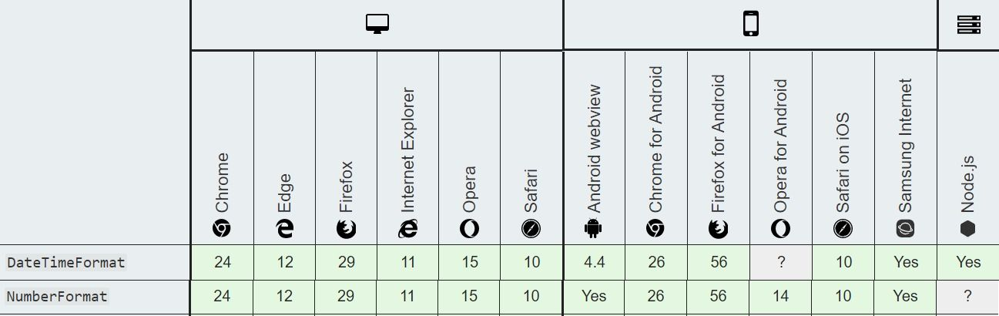

# Transloco Locale L10N

This plugin provides localization(l10n) support for Transloco.

> Localization refers to the adaptation of a product, application or document content to meet the language, cultural and other requirements of a specific target market (a locale).

## Table of Contents

- [Installation](#installation)
- [Setup](#setup)
- [Localization Pipes](#localization-pipes)
  - [Date Pipe](#date-pipe)
  - [Currency Pipe](#currency-pipe)
  - [Decimal Pipe](#decimal-pipe)
  - [Percent Pipe](#percent-pipe)
  - [Browser Support](#browser-support)
- [Setting Locale](#setting-locale)
  - [Locale Translation Files](#translation-files-name)
  - [Language Locale Mapping](#language-locale-mapping)
  - [Manually Setting Locale](#manually-setting-locale)
- [Configuration](#configuration-options)
- [Format Options](#locale-format-options)
  - [Number Format Options](#number-format-options)
  - [Date Format Options](#date-format-options)
- [Service API](#service-api)

## Installation

```
npm i @ngneat/transloco-locale
```

### Setup

Inject `TranslocoLocaleModule` along with `TranslocoModule` into `AppModule`:

```typescript
import { TranslocoLocaleModule } from '@ngneat/transloco-locale';

@NgModule({
  imports: [TranslocoModule, TranslocoLocaleModule.init()],
  bootstrap: [AppComponent]
})
export class AppModule {}
```

### Localization Pipes

The library provides localization pipes base on the native [Javascript's API](https://developer.mozilla.org/en-US/docs/Web/JavaScript/Reference/Global_Objects/Intl).

#### Date Pipe

Transform a date into the locale's date format.

The date expression could be: a `Date` object, a number
(milliseconds since UTC epoch), or an [ISO string](https://www.w3.org/TR/NOTE-datetime).

```html
<!--9/10/2019-->
<span> {{ date | translocoDate }} </span>
<!-- Sep 10, 2019, 10:46:12 PM-->
<span>
  {{ date | translocoDate: { dateStyle: 'medium', timeStyle: 'medium' }}
</span>
<!-- 7:40:32 PM Coordinated-->
<span>
  {{ date | translocoDate: { timeZone: 'UTC', timeStyle: 'full' } }}
</span>
<!-- Jan 1, 1970-->
<span>
  {{ 1 | translocoDate: { dateStyle: 'medium' } }}
</span>
<!-- Feb 8, 2019-->
<span>
  {{ '2019-02-08' | translocoDate: { dateStyle: 'medium' } }}
</span>
```

#### Currency Pipe

Transform a given number into the locale's currency format.

The library comes out of the box with locale currency mapping, so once the locale is change the currency will automatically display the right currency.
The currency mapping could be customise if needed through the [config](#configuration-options), and could be provided by `LOCALE_CURRENCY_MAPPING` token.

```html
<!--$1,000,000.00-->
<span> {{ 1000000 | translocoCurrency }} </span>
<!--1,000,000.00 US dollars-->
<span>
  {{ 1000000 | translocoCurrency: 'name' }}
</span>
<!--$1,000,000-->
<span>
  {{ 1000000 | translocoCurrency: 'symbol' : { minimumFractionDigits: 0 } }}
</span>
```

#### Decimal Pipe

Transform a given number into current locale's decimal number format.

```html
<!--1,234,567,890-->
<span>
  {{ 1234567890 | translocoDecimal }}
</span>
<!--1234567890-->
<span>
  {{ 1234567890 | translocoDecimal: {useGrouping: false} }}
</span>
```

#### Percent Pipe

Transform a given number into current locale's percent number format.

```html
<!--100%-->
<span> 1 | translocoPercent </span>
<!--100%-->
<span> "1" | translocoPercent </span>
```

#### Browser Support



### Setting Locale

The library provides three different ways to set the locale.

##### Translation file names:

Using locale format for the translation files will automatically declare the locale on `langChanges$` event:

```
├─ i18n/
   ├─ en-US.json
   ├─ en-GB.json
   ├─ es-ES.json
```

##### Language Locale Mapping:

Users who don't have more than one locale per language
could provide a language to locale mapping object using the [config's](#configuration-options) `langToLocaleMapping`:

```typescript
@NgModule({
  imports: [
    TranslocoLocaleModule.init({
      langToLocaleMapping: {
        en: 'en-US',
        es: 'es-ES'
      }
    })
  ],
  bootstrap: [AppComponent]
})
export class AppModule {}
```

##### Manually Setting Locale:

The third option in manually setting the locale, this could be done by calling `setLocale` method from `localeService`:

```typescript
export class AppComponent {
  constructor(private service: TranslocoLocaleService) {}

  ngOnInit() {
    this.service.setLocale('en-US');
  }
}
```

### Configuration Options

Let's go over each one of the `config` options:

- `localeConfig?`: Declare the default configuration of the locale's formatting. A general configuration could be set using the `global` property, for a configuration by locale use `localeBased` property (default value determine by the native [Javascript's API](https://developer.mozilla.org/en-US/docs/Web/JavaScript/Reference/Global_Objects/Intl)).
- `defaultLocale?`: The default locale formatted in [BCP 47](https://tools.ietf.org/html/bcp47) (default value: `en-US`),
- `defaultCurrency?`: The default currency formatted in [ISO 4217](https://www.iso.org/iso-4217-currency-codes.html) (default value: `USD`),
- `langToLocaleMapping?`: A key value `object` that maps Transloco language to it's Locale (default value: `{}`).
- `localeToCurrencyMapping?`: A key value `object` that maps the Locale to it's currency (formatted in [ISO 4217](https://www.iso.org/iso-4217-currency-codes.html)) (the library provide a default value with all of the existing mapping).

### Locale Format Options

There are two types of formatting options, one for `date` and one for `number`.

The formatted options could be declared in three levels

1. In the module's configuration (as mentioned above):

```typescript
import { TranslocoLocaleModule } from '@ngneat/transloco-locale';

const globalFormatConfig = {
  date: {
    dateStyle: 'long',
    timeStyle: 'long'
  }
};

const esESFormatConfig = {
  date: {
    timeStyle: 'medium'
  },
  currency: {
    minimumFractionDigits: 0
  }
};

@NgModule({
  imports: [
    TranslocoLocaleModule.init({
      localeConfig: {
        global: globalFormatConfig,
        localeBased: {
          'es-ES': esESFormatConfig
        }
      }
    })
  ]
})
export class AppModule {}
```

2. It could be set in the component's providers using `LOCALE_CONFIG` token:

```typescript
@Component({
  selector: 'my-comp',
  templateUrl: './my-comp.component.html',
  providers: [
    {
      provide: LOCALE_CONFIG,
      useValue: localeConfig
    }
  ]
})
export class MyComponent {}
```

3. We can pass it to each [pipe](#localization-pipes) in the HTML template:

```html
<span>
  {{ date | translocoDate: { dateStyle: 'medium', timeStyle: 'medium' }}
</span>

<span>
  {{ number | translocoDecimal: {useGrouping: false} }}
</span>
```

Note the format option of the global, locale's format and the one's being passed in the template, will be merged. While the template is the stronger one and then the locale and the global.

#### Number Format Options

- `useGrouping`- Whether to use grouping separators, such as thousands separators or thousand/lakh/crore separators. Possible values are true and false; the (default is true).
- `minimumIntegerDigits`- The minimum number of integer digits to use. Possible values are from 1 to 21 (default is 1).
- `minimumFractionDigits`- The minimum number of fraction digits to use. Possible values are from 0 to 20 (default is 0).
- `maximumFractionDigits`- The maximum number of fraction digits to use. Possible values are from 0 to 20 (default is 3).
- `minimumSignificantDigits`- The minimum number of significant digits to use. Possible values are from 1 to 21 (default is 1).
- `maximumSignificantDigits`- The maximum number of significant digits to use. Possible values are from 1 to 21 (default is 21).

#### Date Format Options

- `dateStyle` - The date formatting style.
- `timeStyle` - The time formatting style.
- `timeZone` - The time zone to use. The only value implementations must recognize is "UTC"; the default is the runtime's default time zone. Implementations may also recognize the time zone names of the [IANA](https://www.iana.org/time-zones) time zone database, such as "Asia/Shanghai", "Asia/Kolkata", "America/New_York".

### Service API

- `localeChanges$` - Observable of the active locale.
- `getLocale` - Gets the active locale.
- `setLocale` - Sets the active locale.
